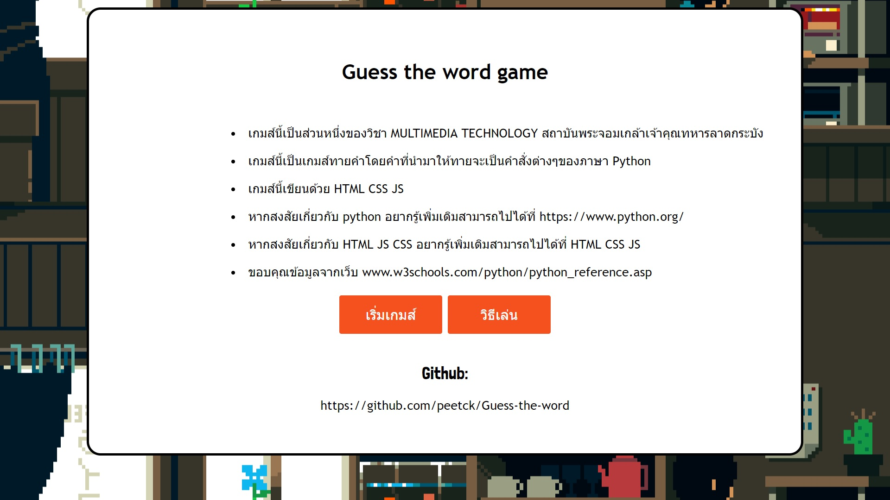
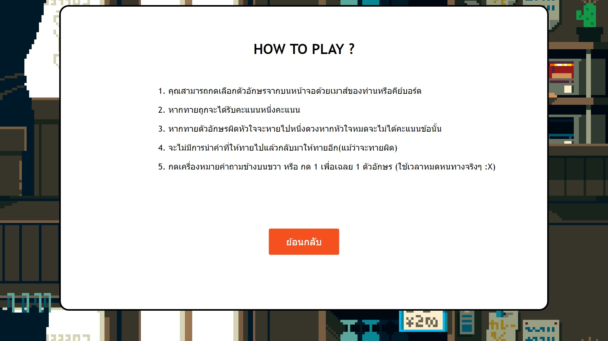
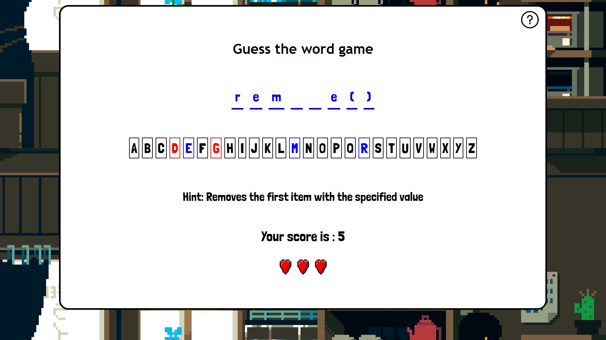

## Guess the word game
* โปรเจคนี้เป็นส่วนหนึ่งของวิชา MULTIMEDIA TECHNOLOGY
คณะเทคโนโลยีสารสนเทศ สถาบันพระจอมเกล้าเจ้าคุณทหารลาดกระบัง
* พวกเราเขียนเกมทายคําศัพท์(คําสั่งต่างๆในภาษา python)
* ขอบคุณข้อมูลจากเว็บ www.w3schools.com/python/python_reference.asp
## Built With
* <a href="https://en.wikipedia.org/wiki/HTML" target="_blank">HTML</a> Hypertext Markup Language
* <a href="https://en.wikipedia.org/wiki/Cascading_Style_Sheets" target="_blank">CSS</a> Cascading Style Sheets 
* <a href="https://en.wikipedia.org/wiki/JavaScript" target="_blank">JS</a> JavaScript
## Interface

## Group Members
 ||||||
 |:---:|:---:|:---:|:---:|:--:|
|[peetck](https://github.com/peetck)|[thangmo29](https://github.com/thangmo29)|[skaferun9](https://github.com/skaferun9)|[blackjokerr](https://github.com/blackjokerrr)|[nnotex99](https://github.com/nnotex99)|

